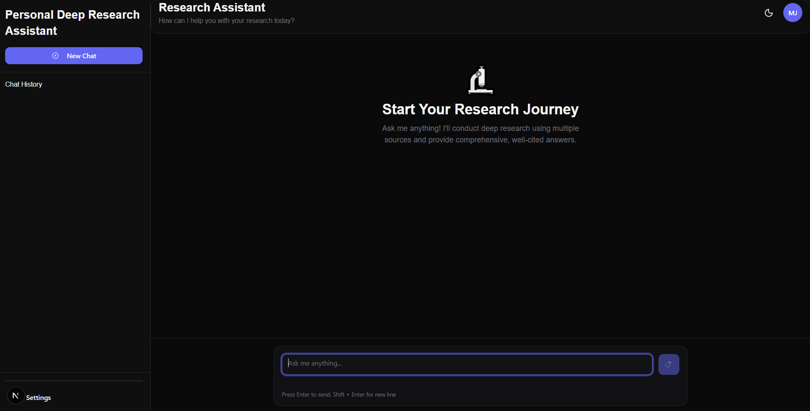
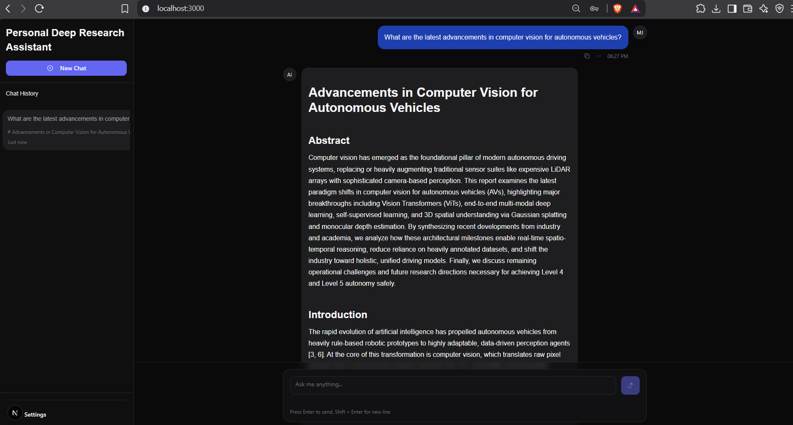
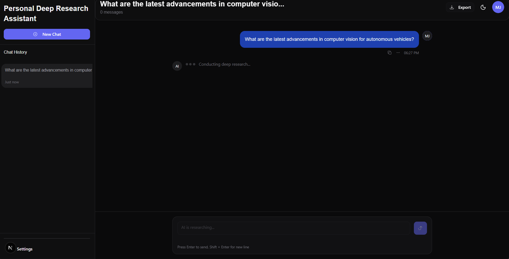
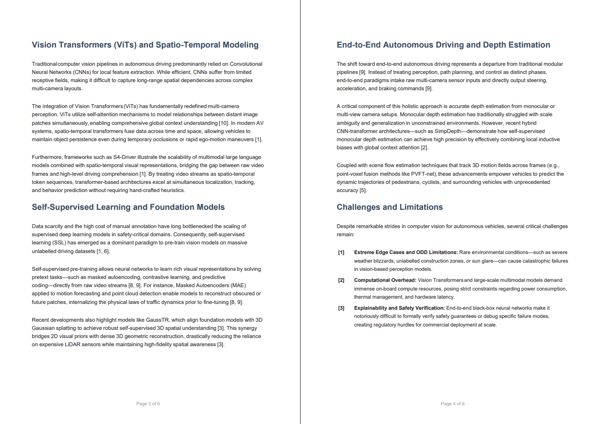
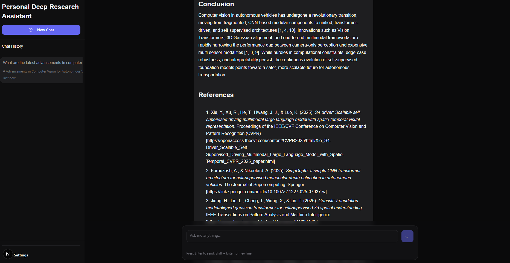
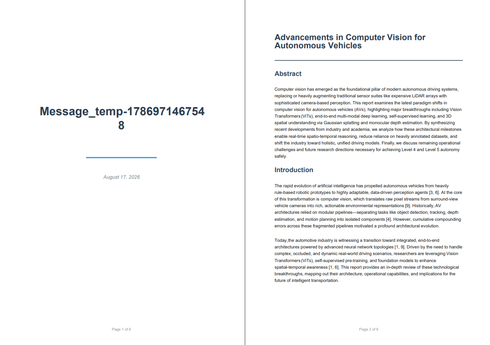

# Intelligent Research Assistant

An AI-powered deep research assistant that searches the web, academic literature, and recent news, then synthesizes the collected information into structured, well-cited research reports.

The application combines multi-source research, AI-powered synthesis, persistent research conversations, authentication, and report export into a single interface.


---

## Demo

### Research Assistant



### Generated Research Report



### Research in Progress



---

## Demo Video

▶️ [Watch the Intelligent Research Assistant Demo on Loom](https://www.loom.com/share/a2119070da0e40c0b80afda49d2ad7b0?t=107)

---

## Overview

Traditional research often requires manually switching between search engines, academic databases, news websites, note-taking tools, and document editors.

This project combines those steps into a single AI-assisted research workflow.

A user enters a research question, and the system:

1. Searches the web for general information.
2. Searches Google Scholar for academic literature.
3. Searches Google News for recent developments.
4. Collects and evaluates the retrieved information.
5. Uses Gemini 3.5 Flash-Lite to synthesize the findings.
6. Generates a structured report with numbered citations and references.
7. Allows the generated report to be exported into supported formats.

---

## Key Features

### Multi-Source Research

The Research Agent can gather information from multiple sources:

- Google Search for general web information
- Google Scholar for academic papers and scholarly sources
- Google News for recent developments
- Additional search and fallback integrations available in the project

This allows the system to combine general, academic, and recent information instead of relying on a single source.

### AI-Powered Research Synthesis

Retrieved research is passed to **Gemini 3.5 Flash-Lite** for synthesis.

The system can generate structured reports containing sections such as:

- Abstract
- Introduction
- Background or related work
- Technical analysis
- Applications
- Challenges and limitations
- Future directions
- Conclusion
- References

The report structure can adapt to the type of research being performed.

### Academic-Oriented Research

For research topics that benefit from academic literature, the Research Agent uses Google Scholar to retrieve papers and publication information.

Generated reports use numbered citations such as:

```text
[1], [2], [3]
````

The references section includes source information and URLs so users can trace the research material.

### Persistent Research Conversations

Users can:

* Create research conversations
* Continue previous research
* Browse previous chat sessions
* Resume earlier research
* Maintain user-specific research data

### Authentication

The application includes:

* User registration
* User login
* JWT-based authentication
* Password hashing
* Protected API routes
* User-specific data isolation

### Report Export

Generated research can be exported into supported formats including:

* PDF
* HTML
* Markdown

### Adaptive Report Structure

The generated report structure can adapt to different research types.

For example:

#### Technical Research

```text
Abstract
Introduction
Related Work
Architecture
Implementation
Evaluation
Conclusion
References
```

#### Review / Survey Research

```text
Abstract
Introduction
Background
Current State
Trends and Developments
Challenges
Future Directions
Conclusion
References
```

---

## Example Research Query

```text
What are the latest advancements in computer vision for autonomous vehicles?
```

A generated report for this topic can cover areas such as:

* Vision Transformers
* Spatiotemporal modeling
* Bird's-Eye-View (BEV) representations
* Sensor fusion
* End-to-end autonomous driving
* Self-supervised learning
* Foundation models
* Synthetic data
* Edge AI
* Safety and generalization challenges

---

## Architecture

The current research workflow uses the Research Agent directly from the research API.

```text
                         ┌──────────────────────┐
                         │        User          │
                         │  Research Question   │
                         └──────────┬───────────┘
                                    │
                                    ▼
                         ┌──────────────────────┐
                         │   Next.js Frontend   │
                         │   Research Chat UI   │
                         └──────────┬───────────┘
                                    │
                                    ▼
                         ┌──────────────────────┐
                         │    Research API      │
                         │   Next.js API Route  │
                         └──────────┬───────────┘
                                    │
                                    ▼
                         ┌──────────────────────┐
                         │   Research Agent     │
                         │       Mastra         │
                         └──────────┬───────────┘
                                    │
                 ┌──────────────────┼──────────────────┐
                 │                  │                  │
                 ▼                  ▼                  ▼
        ┌────────────────┐ ┌────────────────┐ ┌────────────────┐
        │ Google Search  │ │ Google Scholar │ │   Google News  │
        │    SerpAPI     │ │    SerpAPI     │ │    SerpAPI     │
        └────────────────┘ └────────────────┘ └────────────────┘
                 │                  │                  │
                 └──────────────────┼──────────────────┘
                                    │
                                    ▼
                         ┌──────────────────────┐
                         │ Gemini 3.5 Flash-Lite│
                         │    AI Synthesis      │
                         └──────────┬───────────┘
                                    │
                                    ▼
                         ┌──────────────────────┐
                         │ Structured Research  │
                         │       Report         │
                         └──────────┬───────────┘
                                    │
                       ┌────────────┼────────────┐
                       │            │            │
                       ▼            ▼            ▼
                     PDF          HTML       Markdown
```

### Agent Architecture

The project also contains additional Mastra agents for other research-related workflows:

```text
Mastra
├── Master Agent
├── Research Agent
├── Draft Agent
└── Export Agent
```

The current `/api/research` endpoint uses the **Research Agent directly** so that the core research workflow remains deterministic and focused.

---

## Research Workflow

### 1. User Query

The user enters a research question in the web interface.

Example:

```text
What are the latest advancements in computer vision for autonomous vehicles?
```

### 2. Web Search

The Research Agent uses Google Search to collect general information and relevant web sources.

### 3. Academic Search

Google Scholar is used to retrieve relevant academic papers, publication information, abstracts, and citation data.

### 4. Recent Information

Google News is used to retrieve recent developments when current information is relevant to the topic.

### 5. Source Evaluation

The agent evaluates the collected information and selects useful sources for synthesis.

### 6. AI Synthesis

Gemini 3.5 Flash-Lite analyzes the retrieved information and generates a structured research report.

### 7. Citation Generation

The generated report includes numbered citations and a references section containing source details and URLs.

### 8. Export

The completed report can be exported into supported document formats.

---

## Tech Stack

### Frontend

* Next.js 15
* React 19
* TypeScript
* Tailwind CSS
* Radix UI / shadcn-style UI components

### Backend

* Next.js API Routes
* Mastra
* MongoDB
* JWT Authentication
* bcrypt

### AI

* Gemini 3.5 Flash-Lite
* AI SDK
* Mastra Agent framework
* Google embedding infrastructure for semantic memory

### Search and Research

* SerpAPI
* Google Search
* Google Scholar
* Google News
* Perplexity AI fallback integration

### Export

* jsPDF
* Markdown processing
* HTML generation

---

## Project Structure

```text
Intelligent-Research-Assistant/
│
├── app/
│   ├── api/
│   │   ├── auth/
│   │   ├── chats/
│   │   ├── research/
│   │   ├── reports/
│   │   └── export/
│   │
│   ├── auth/
│   ├── layout.tsx
│   └── page.tsx
│
├── components/
│   ├── auth/
│   ├── chat/
│   └── ui/
│
├── lib/
│   ├── mastra/
│   │   ├── agents/
│   │   │   ├── master-agent.ts
│   │   │   ├── research-agent.ts
│   │   │   ├── draft-agent.ts
│   │   │   └── export-agent.ts
│   │   │
│   │   ├── index.ts
│   │   ├── mcp.ts
│   │   └── serpapi-tool.ts
│   │
│   ├── services/
│   ├── contexts/
│   ├── hooks/
│   └── export-utils.ts
│
├── docs/
│   ├── images/
│   └── project documentation
│
├── types/
├── public/
├── package.json
└── README.md
```

---

## Screenshots

### Technical Research Content



### References and Sources



### PDF Export



---

## Getting Started

### Prerequisites

Make sure the following are installed:

* Node.js 20+
* npm
* MongoDB
* Google AI API key
* SerpAPI API key

Optional integrations:

* Perplexity API key
* Turso credentials

---

## Installation

### 1. Clone the Repository

```bash
git clone https://github.com/mohtashim009/Intelligent-Research-Assistant.git
cd Intelligent-Research-Assistant
```

### 2. Install Dependencies

```bash
npm install
```

### 3. Configure Environment Variables

Create a `.env.local` file in the project root.

Example:

```env
# MongoDB
MONGODB_URI=mongodb://localhost:27017/research-assistant

# JWT
JWT_SECRET=your-secret-key

# Google AI / Gemini
GOOGLE_GENERATIVE_AI_API_KEY=your-google-api-key

# SerpAPI
SERPAPI_API_KEY=your-serpapi-api-key

# Optional fallback integration
PERPLEXITY_API_KEY=your-perplexity-api-key

# Optional semantic memory / Turso
TURSO_DATABASE_URL=your-turso-database-url
TURSO_AUTH_TOKEN=your-turso-auth-token
```

> Never commit `.env.local` or expose API keys publicly.

---

## Run the Application

Start the development server:

```bash
npm run dev
```

Open:

```text
http://localhost:3000
```

---

## Production Build

Create a production build:

```bash
npm run build
```

Start the production server:

```bash
npm start
```

---

## Environment Variables

| Variable                       | Required | Purpose                       |
| ------------------------------ | -------- | ----------------------------- |
| `MONGODB_URI`                  | Yes      | MongoDB connection            |
| `JWT_SECRET`                   | Yes      | JWT authentication            |
| `GOOGLE_GENERATIVE_AI_API_KEY` | Yes      | Gemini model access           |
| `SERPAPI_API_KEY`              | Yes      | Web, Scholar, and News search |
| `PERPLEXITY_API_KEY`           | Optional | Fallback research integration |
| `TURSO_DATABASE_URL`           | Optional | Remote semantic memory        |
| `TURSO_AUTH_TOKEN`             | Optional | Turso authentication          |

---

## API Endpoints

### Authentication

```text
POST /api/auth/register
POST /api/auth/login
GET  /api/auth/me
```

### Chats

```text
GET  /api/chats
POST /api/chats
GET  /api/chats/:chatId
POST /api/chats/:chatId/messages
```

### Research

```text
POST /api/research
```

### Reports

```text
GET /api/reports
GET /api/reports/:reportId
```

### Export

```text
POST /api/export/enhance
```

---

## Example Usage

### Research

```text
What are the latest advancements in computer vision for autonomous vehicles?
```

### Other Examples

```text
Research quantum computing applications in cryptography.
```

```text
What are the latest developments in AI safety?
```

```text
Explain recent advances in renewable energy storage.
```

---

## Report Output

Generated reports can contain sections such as:

```text
Title
Abstract
Introduction
Background / Related Work
Technical Analysis
Applications
Challenges and Limitations
Future Directions
Conclusion
References
```

The exact structure can adapt to the research topic.

---

## Security

The application includes:

* JWT-based authentication
* Password hashing using bcrypt
* Protected API routes
* User-specific data isolation
* Server-side API key usage
* MongoDB persistence
* Environment-based secret configuration

---

## Development Commands

### Development

```bash
npm run dev
```

### Production Build

```bash
npm run build
```

### Production Start

```bash
npm start
```

### Lint

```bash
npm run lint
```

---

## Documentation

Additional project documentation is available in the `docs/` directory.

Useful documentation includes:

* Project documentation
* Authentication guide
* Chat persistence guide
* Multi-agent architecture
* Semantic memory setup
* Google API setup

---

## Project Highlights

* Multi-source AI research workflow
* Academic literature retrieval
* Recent news retrieval
* AI-generated research synthesis
* Citation-based reports
* Persistent research conversations
* Authentication and user isolation
* Multiple report export formats
* Modular Mastra agent architecture

---

## Future Improvements

Potential future improvements include:

* Streaming detailed research progress directly into the UI
* Source credibility scoring
* More advanced source ranking
* Improved citation verification
* Additional academic databases
* Richer research visualizations
* More report export formats
* Expanded agent orchestration workflows
* Production observability and monitoring

---

## Acknowledgments

This project uses and builds on several technologies and services:

* [Next.js](https://nextjs.org/)
* [React](https://react.dev/)
* [Mastra](https://mastra.ai/)
* [Google AI](https://ai.google.dev/)
* [SerpAPI](https://serpapi.com/)
* [MongoDB](https://www.mongodb.com/)
* [Perplexity AI](https://www.perplexity.ai/)

---

## License

This project is licensed under the MIT License.

---

## Author

**Mohtashim**

GitHub:

[https://github.com/mohtashim009](https://github.com/mohtashim009)

Project Repository:

[https://github.com/mohtashim009/Intelligent-Research-Assistant](https://github.com/mohtashim009/Intelligent-Research-Assistant)